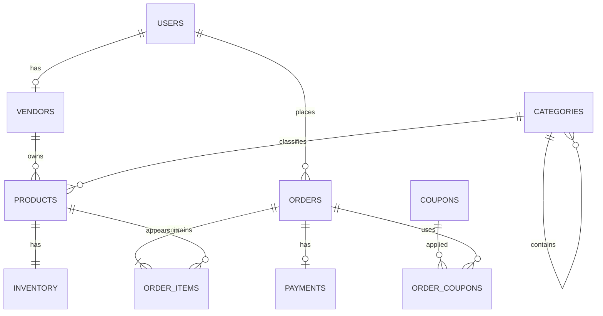

# ER Diagram

```mermaid
erDiagram
 USERS ||--o| VENDORS : has
 USERS ||--o{ ORDERS : places
 CATEGORIES ||--o{ CATEGORIES : contains
 VENDORS ||--o{ PRODUCTS : owns
 CATEGORIES ||--o{ PRODUCTS : classifies
 PRODUCTS ||--|| INVENTORY : has
 ORDERS ||--|{ ORDER_ITEMS : contains
 PRODUCTS ||--o{ ORDER_ITEMS : appears_in
 ORDERS ||--o| PAYMENTS : has
 COUPONS ||--o{ ORDER_COUPONS : applied
 ORDERS ||--o{ ORDER_COUPONS : uses
```
